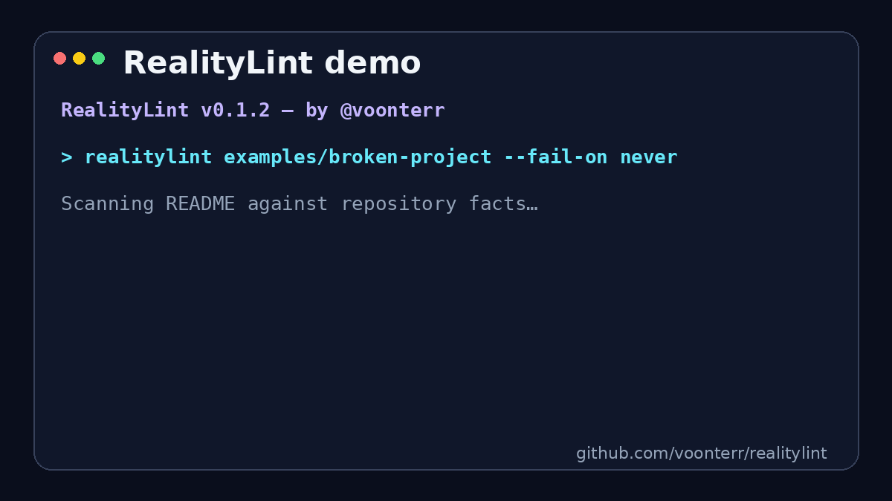

<div align="center">


# RealityLint

**README говорит, что проект работает. RealityLint проверяет, так ли это на самом деле.**

Статическая и детерминированная проверка README по реальному содержимому репозитория — **без выполнения команд из документации, без LLM и без отправки исходного кода наружу.**

**by [@voonterr](https://github.com/voonterr)**

[English](README.md) · [Русский](README.ru.md)

[](https://github.com/voonterr/realitylint/actions/workflows/ci.yml)
[](https://www.python.org/)
[](https://pypi.org/project/realitylint/)
[](LICENSE)
[](https://github.com/voonterr/realitylint/stargazers)

`локальная работа` · `без API-ключа` · `без LLM` · `для CI` · `безопасный статический анализ`

</div>

---

## Проблема

README со временем перестаёт соответствовать проекту.

Переименовали команду. Перенесли файл. Удалили `.env.example`. Перешли с Yarn на npm. Или AI сгенерировал уверенную инструкцию про скрипт, которого в проекте никогда не было.

Обычные Markdown-линтеры проверяют оформление документа. RealityLint отвечает на другой вопрос:

> **Соответствуют ли проверяемые утверждения из README реальному состоянию репозитория?**

RealityLint специально работает консервативно: если утверждение нельзя доказать локальными данными репозитория, проверка его пропускает, а не пытается угадать.

## Демо за 30 секунд

<p align="center">
  
</p>

```bash
realitylint examples/broken-project --fail-on never
```

```text
RealityLint v0.1.3 — by @voonterr
RealityLint score: 34/100

✗ README.md:3 ERROR   RL002 Ссылка ведёт на отсутствующий "docs/setup.md".
! README.md:6 WARNING RL004 README использует yarn, но найден только npm lockfile.
✗ README.md:7 ERROR   RL001 Скрипт "dev" отсутствует в package.json.
✗ README.md:8 ERROR   RL003 Файл ".env.example" отсутствует.
✗ README.md:9 ERROR   RL005 Python-файл "scripts/start.py" отсутствует.

4 error(s), 1 warning(s), 0 notice(s).
```

> Сам CLI пока выводит сообщения правил на английском. Русская локализация интерфейса может быть добавлена позже; логика проверки от языка README не зависит.

## Зачем RealityLint?

| | RealityLint |
|---|---|
| **Детерминированность** | Один и тот же репозиторий → один и тот же результат. |
| **Безопасность** | Команды из README разбираются, но никогда не выполняются. |
| **Приватность** | Репозиторий не отправляется во внешние сервисы. |
| **Удобство для CI** | Text, JSON, Markdown и SARIF. |
| **Минимум ложных ошибок** | Неоднозначные утверждения пропускаются. |
| **Поддержка монорепозиториев** | Понимает конструкции вроде `cd frontend && ...`. |

## Что проверяется

| Правило | Что проверяет RealityLint |
|---|---|
| `RL000` | Безопасность и доступность репозитория/README перед сканированием |
| `RL001` | Наличие npm/pnpm/yarn/bun scripts в нужном `package.json` |
| `RL002` | Существование относительных Markdown-ссылок и изображений |
| `RL003` | Наличие указанных `.env.example` / `.env.sample` |
| `RL004` | Соответствие package manager найденному lock-файлу |
| `RL005` | Существование Python entry-файлов из команд README |
| `RL006` | Существование Make targets в GNUmakefile/makefile/Makefile |
| `RL007` | Соответствие указанной версии проекта `[project].version` |
| `RL008` | Наличие LICENSE/COPYING при заявленной лицензии |
| `RL009` | Существование очевидных путей к файлам из текста *(notice)* |
| `RL010` | Битые metadata-файлы дают понятную ошибку вместо падения сканера |

Также поддерживаются `cd subdir && ...`, `npm --prefix`, `yarn --cwd`, `pnpm --dir` / `pnpm -C`, `bun --cwd`, `make -C`, вложенные README, Windows-пути и prompt'ы, shell-блоки с ```/~~~ и некоторые inline-команды.

## Быстрый старт

**Нужен Python 3.10+.**

Установка из PyPI:

```bash
python -m pip install realitylint
```

Проверить текущий репозиторий:

```bash
realitylint .
```

Проверить другой репозиторий:

```bash
realitylint /path/to/repository
```

Установить последнюю версию напрямую из исходного кода:

```bash
git clone https://github.com/voonterr/realitylint.git
cd realitylint
python -m pip install -e .
```

Проверить специально сломанный пример:

```bash
realitylint examples/broken-project --fail-on never
```
## GitHub Actions

Добавьте в другой проект `.github/workflows/realitylint.yml`:

```yaml
name: README reality check
on: [pull_request]

permissions:
  contents: read

jobs:
  realitylint:
    runs-on: ubuntu-latest
    steps:
      - uses: actions/checkout@v7
      - uses: voonterr/realitylint@v1
        with:
          fail-on: error
```

Action создаёт inline-аннотации и Markdown summary прямо в GitHub Actions.


## Форматы вывода

```bash
realitylint . --format text
realitylint . --format json
realitylint . --format markdown
realitylint . --format sarif
```

Политика завершения CI:

```bash
realitylint . --fail-on error
realitylint . --fail-on warning
realitylint . --fail-on never
```

В JSON и SARIF текстовый баннер `by @voonterr` не добавляется, поэтому машинный вывод остаётся валидным.

## Безопасность

RealityLint — **статический анализатор**, а не sandbox.

- Команды из README **никогда не выполняются**.
- `--readme` не может выйти за корень репозитория.
- Symlink и пути проверяются до чтения файлов.
- Для README и metadata установлены ограничения размера.
- Inputs GitHub Action передаются через переменные окружения, а не вставляются напрямую в shell-команду.
- Управляющие символы GitHub annotations экранируются.
- Сторонние Actions самого проекта закреплены по immutable commit SHA.
- Самому сканеру не нужен сетевой доступ.

Уязвимость лучше сообщать по инструкции из [SECURITY.md](SECURITY.md), а не публиковать exploit в открытом issue.

## Принципы проекта

1. **Факты вместо догадок.** Каждая ошибка должна опираться на данные репозитория.
2. **Никакого произвольного выполнения.** README анализируется статически.
3. **Лучше промолчать, чем дать ложную ошибку.** Неоднозначный синтаксис пропускается.
4. **Local-first.** Код и документация остаются на компьютере пользователя.
5. **Маленькие независимые правила.** Новые проверки должны легко тестироваться.

## Roadmap

Ближайшие направления:

- [ ] Go: `go run`, module path и версия toolchain
- [ ] Rust: `cargo run --bin`, features и MSRV
- [ ] Docker Compose: services и ports
- [ ] Проверка `.env`: code ↔ template ↔ docs
- [ ] pre-commit hook
- [ ] ignore directives для намеренно неправильных примеров
- [ ] проверка CLI-флагов по сохранённому `--help`

Подробности: [ROADMAP.md](ROADMAP.md).

## Как помочь проекту

Приветствуются bug reports, идеи новых правил и pull requests.

```bash
python -m unittest discover -s tests -v
```

Перед первым PR прочитайте [CONTRIBUTING.md](CONTRIBUTING.md). Для предложения нового правила также можно использовать готовый Issue Template.

## Статус

RealityLint пока находится в стадии **alpha**. Он намеренно проверяет ограниченный набор утверждений и не пытается «понимать» любой shell-код или любой стиль документации.

## Автор

Создан и поддерживается **[@voonterr](https://github.com/voonterr)**.

Если RealityLint помог найти сломанную инструкцию, поставьте ⭐ репозиторию — так проект смогут найти другие разработчики.

## Лицензия

MIT License. Copyright © 2026 voonterr. См. [LICENSE](LICENSE).
